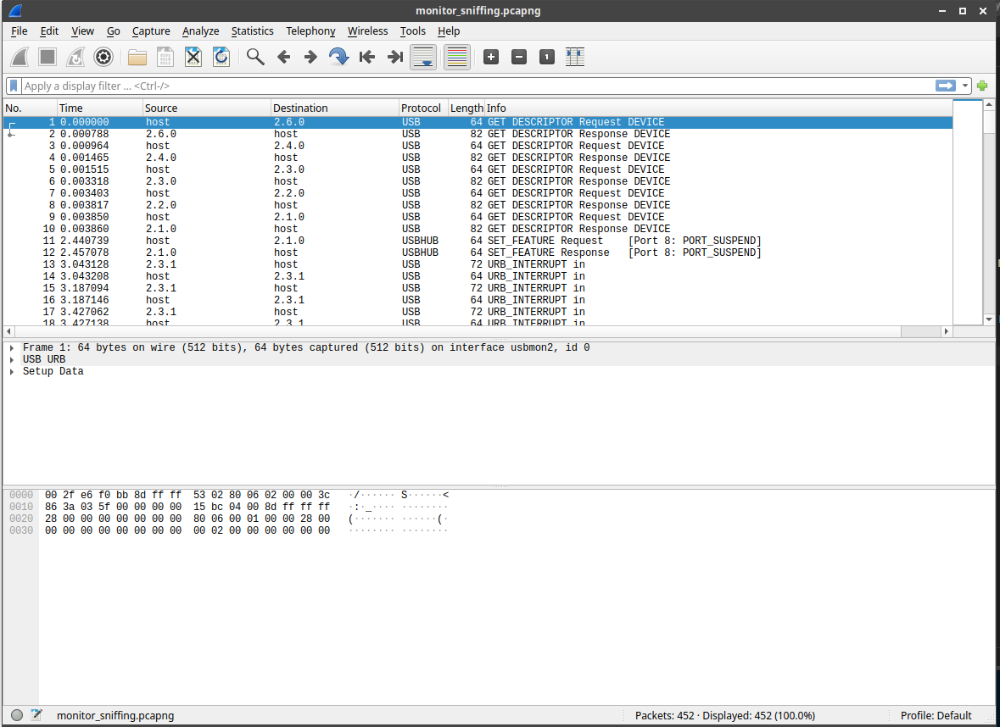
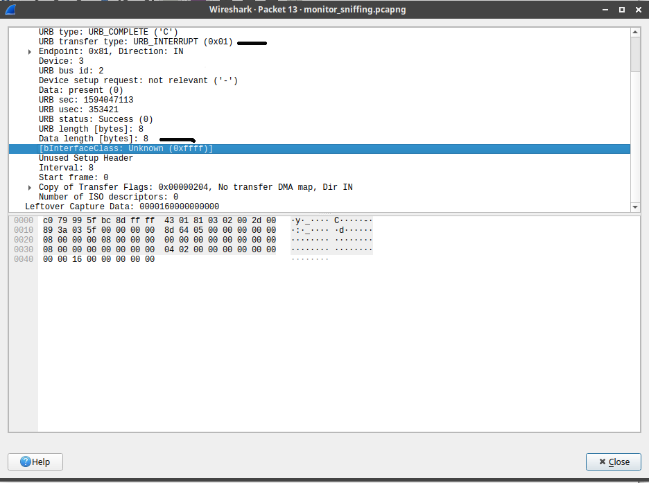
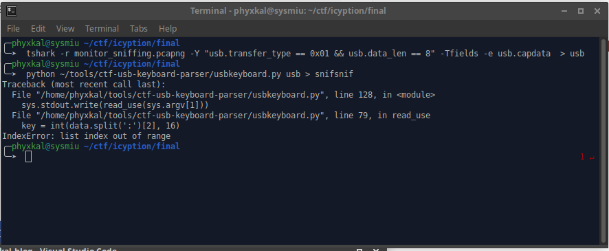
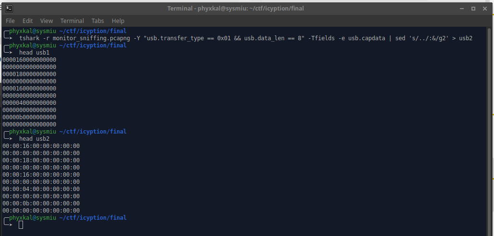
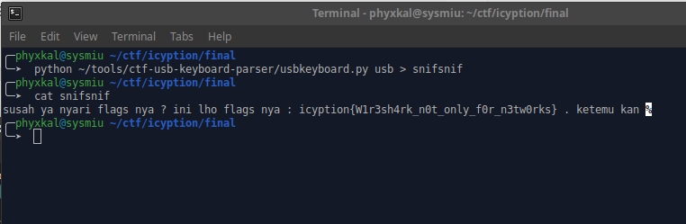

Tulisan pertama tentang CTF di blog ini. Jadi ini soal final dari lomba Icyption yang diadakan
oleh Telkom University.

Diberikan sebuah file pcapng yg bernama `monitor_sniffing.pcapng`. Soal forensic model network menggunakan wireshark yang jarang keluar di CTF,
karena berbeda dari kasus-kasus soal lain, di soal ini kita disuruh mencari flag melalu protokol yg berbeda dari soal-soal lain.

Jadi setelah dianalisa ternyata protokolnya itu di USB, seperti berikut



Kalau kita lihat bInterfaceClass-nya kita bisa mengetahui bahwa protokol ini adalah inputan uknown entah dari mouse atau keyboard karena bernilai `Unknown (0xffff)`.

Dan setiap koneksi dari source 2.3.1 (yang mana merupakan mouse/keyboard tersebut) ke destination host(komputer dari si pengguna) selalu diakhiri 8 bit angka yg aneh, dan kalau dibuka ternyata itu `Leftover Capture Data` dari paket tersebut.
Menarik, mungkin ini inputan atau klik keyboard melalui USB.



Kita langsung saja mengambil paket yg memiliki data dari klikan keyboard, karena terlihat bahwa 12 paket awal adalah koneksi awal maka abaikan saja.
Langsung lihat paket ke 13 yang memiliki `Leftover Capture Data`. Terlihat juga bahwa alurnya dari 13 sampe paket ke 400an.
Sangat banyak maka dari itu kita menggunakan tshark untuk mengambil paketnya, dengan menggunakan parameter dari `usb transfer type` dan `usb data length` seperti pada gambar di atas.

```
tshark -r monitor_sniffing.pcapng -Y "usb.transfer_type == 0x01 && usb.data_len == 8" -Tfields -e usb.capdata > usb
```

Setelah itu didecode sesuai dengan aturan yg ada seperti di documentation dari [`USB HID Usage Tables`](https://usb.org/sites/default/files/documents/hut1_12v2.pdf) di halaman 53 tabel ke 12.

Langsung aja pake script python yang ternyata sudah ada yg pernah buat oleh TeamRocketIst, isi codenya sesuai dengan aturan USB HID Usage Tables, mengubah hex bit ke 3.

Misal jika merujuk ke panduan itu maka hex 0x16 yg ada di baris awal itu seharusnya di ubah menjadi s, maka huruf awal pada flag seharusnya huruf s.

berikut codenya dari repo [TeamRockerIst](github.com/TeamRocketIst/ctf-usb-keyboard-parser/blob/master/usbkeyboard.py)


```python
#!/usr/bin/python
# -*- coding: utf-8 -*-
import sys
KEY_CODES = {
    0x04:['a', 'A'],
    0x05:['b', 'B'],
    0x06:['c', 'C'],
    0x07:['d', 'D'],
    0x08:['e', 'E'],
    0x09:['f', 'F'],
    0x0A:['g', 'G'],
    0x0B:['h', 'H'],
    0x0C:['i', 'I'],
    0x0D:['j', 'J'],
    0x0E:['k', 'K'],
    0x0F:['l', 'L'],
    0x10:['m', 'M'],
    0x11:['n', 'N'],
    0x12:['o', 'O'],
    0x13:['p', 'P'],
    0x14:['q', 'Q'],
    0x15:['r', 'R'],
    0x16:['s', 'S'],
    0x17:['t', 'T'],
    0x18:['u', 'U'],
    0x19:['v', 'V'],
    0x1A:['w', 'W'],
    0x1B:['x', 'X'],
    0x1C:['y', 'Y'],
    0x1D:['z', 'Z'],
    0x1E:['1', '!'],
    0x1F:['2', '@'],
    0x20:['3', '#'],
    0x21:['4', '$'],
    0x22:['5', '%'],
    0x23:['6', '^'],
    0x24:['7', '&'],
    0x25:['8', '*'],
    0x26:['9', '('],
    0x27:['0', ')'],
    0x28:['\n','\n'],
    0x29:['[ESC]','[ESC]'],
    0x2a:['[BACKSPACE]', '[BACKSPACE]'],
    0x2C:[' ', ' '],
    0x2D:['-', '_'],
    0x2E:['=', '+'],
    0x2F:['[', '{'],
    0x30:[']', '}'],
    0x32:['#','~'],
    0x33:[';', ':'],
    0x34:['\'', '"'],
    0x36:[',', '<'],
    0x37:['.', '>'],
    0x38:['/', '?'],
    0x39:['[CAPSLOCK]','[CAPSLOCK]'],
    0x2b:['\t','\t'],
    0x4f:[u'→',u'→'],
    0x50:[u'←',u'←'],
    0x52:[u'↑',u'↑']
    0x51:[u'↓',u'↓'],
}


#tshark -r ./usb.pcap -Y 'usb.capdata' -T fields -e usb.capdata > keyboards.txt
def read_use(file):
    with open(file, 'r') as f:
        datas = f.read().split('\n')
    datas = [d.strip() for d in datas if d] 
    cursor_x = 0
    cursor_y = 0
    offset_current_line = 0
    lines = []
    output = ''
    skip_next = False
    lines.append("")
    
    for data in datas:
        shift = int(data.split(':')[0], 16) # 0x2 is left shift 0x20 is right shift
        key = int(data.split(':')[2], 16)

        if skip_next:
            skip_next = False
            continue
        
        if key == 0 or int(data.split(':')[3], 16) > 0:
            continue
        
        if shift != 0:
            shift=1
            skip_next = True

        if KEY_CODES[key][shift] == u'↑':
            lines[cursor_y] += output
            output = ''
            cursor_y -= 1
        elif KEY_CODES[key][shift] == u'↓':
            lines[cursor_y] += output
            output = ''
            cursor_y += 1
        elif KEY_CODES[key][shift] == u'→':
            cursor_x += 1
        elif KEY_CODES[key][shift] == u'←':
            cursor_x -= 1
        elif KEY_CODES[key][shift] == '\n':
            lines.append("")
            lines[cursor_y] += output
            cursor_x = 0
            cursor_y += 1
            output = ''
        elif KEY_CODES[key][shift] == '[BACKSPACE]':
            output = output[:-1]
            #lines[cursor_y] = output
            cursor_x -= 1
        else:
            output += KEY_CODES[key][shift]
            #lines[cursor_y] = output
            cursor_x += 1

    if lines == [""]:
        lines[0] = output

    return '\n'.join(lines)

if __name__ == '__main__':
    if len(sys.argv) < 2:
        print('Missing file to read...')
        exit(-1)
    sys.stdout.write(read_use(sys.argv[1]))
```

Langsung dijalankan ternyata muncul error seperti berikut.



Setelah dilihat ternyata setiap 1 bit harus dibatasi oleh tanda `:`, maka kita harus pipe commandnya agar menambahkan tanda `:` dengan command `sed`.

```
tshark -r monitor_sniffing.pcapng -Y "usb.transfer_type == 0x01 && usb.data_len == 8" -Tfields -e usb.capdata | sed 's/../:&/g2' > usb2
```

Berikut adalah perbedaan dari file yg telah didiberika `:` dengan yg awal tadi.



Langsung aja didecode dengan script python tadi, seperti berikut.



Ketemukan.

Flagnya: `icyption{W1r3sh4rk_n0t_only_f0r_n3tw0rks}`.

PS: another writeup about model forensic challenges like this is [kaizen-ctf 2018 — Reverse Engineer usb keystrok from pcap file](https://medium.com/@ali.bawazeeer/kaizen-ctf-2018-reverse-engineer-usb-keystrok-from-pcap-file-2412351679f4)
